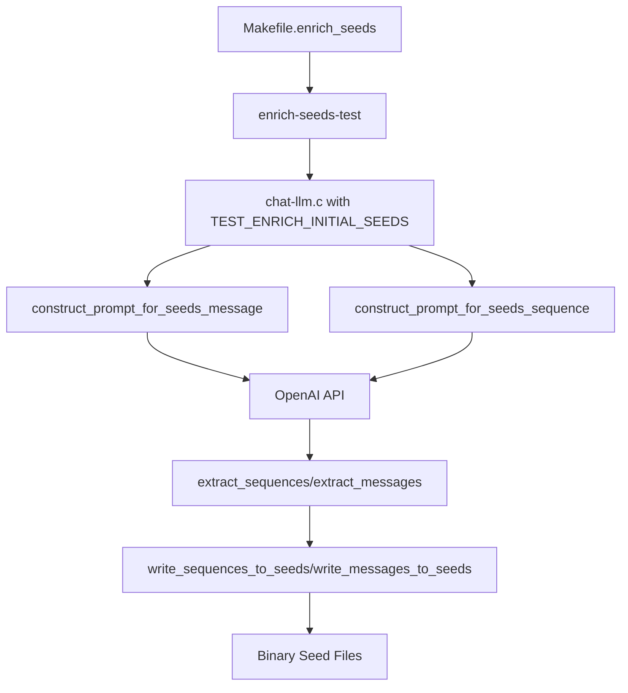

# Initial Seeds Enrichment Testing

This directory contains test infrastructure for the **Initial Seeds Enrichment** functionality of AFL-ICS, which uses Large Language Models (LLMs) to generate high-quality fuzzing seeds for industrial protocols.

## 📋 Table of Contents

- [Overview](#overview)
- [Prerequisites](#prerequisites)
- [Quick Start](#quick-start)
- [Detailed Usage](#detailed-usage)
- [Test Results](#test-results)
- [Troubleshooting](#troubleshooting)
- [Protocol Support](#protocol-support)
- [Implementation Details](#implementation-details)

## 🔍 Overview

The Initial Seeds Enrichment feature generates two types of fuzzing seeds:

1. **Message-level seeds**: Individual protocol messages generated based on protocol specifications
2. **Sequence-level seeds**: Multi-message sequences following protocol state machines

This testing framework validates that:
- LLM integration works correctly
- Binary data handling preserves null bytes
- Protocol-specific seeds are generated properly
- Generated seeds are valid for fuzzing

## 🛠️ Prerequisites

### System Requirements
- Linux/macOS with GCC compiler
- OpenAI API access (requires API key)
- Internet connection for LLM communication

### Required Libraries
Install the following development libraries:

```bash
# Ubuntu/Debian
sudo apt-get install libcurl4-openssl-dev libjson-c-dev libpcre2-dev

# macOS with Homebrew
brew install curl json-c pcre2
```

### Environment Setup
Set your OpenAI API key:

```bash
export OPENAI_API_KEY="your-openai-api-key-here"
```

## 🚀 Quick Start

1. **Navigate to the test directory:**
   ```bash
   cd functional_test
   ```

2. **Run a quick test:**
   ```bash
   make -f Makefile.enrich_seeds test-quick
   ```

3. **Check the results:**
   ```bash
   ls -la test_output/
   ```

## 📖 Detailed Usage

### Building the Test Executable

```bash
# Build the test program
make -f Makefile.enrich_seeds all

# This creates: enrich-seeds-test
```

### Available Test Targets

| Target | Description | Protocol |
|--------|-------------|----------|
| `test-modbus` | Test MODBUS protocol seed generation | MODBUS |
| `test-iec104` | Test IEC104 protocol seed generation | IEC104 |
| `test-ethernetip` | Test EtherNet/IP protocol seed generation | EtherNet/IP |
| `test-slmp` | Test SLMP protocol seed generation | SLMP |
| `test-all` | Run all protocol tests sequentially | All |
| `test-quick` | Quick test with MODBUS | MODBUS |
| `debug-test` | Debug mode with verbose output | MODBUS |

### Running Individual Protocol Tests

```bash
# Test MODBUS protocol
make -f Makefile.enrich_seeds test-modbus

# Test IEC104 protocol  
make -f Makefile.enrich_seeds test-iec104

# Test EtherNet/IP protocol
make -f Makefile.enrich_seeds test-ethernetip

# Test SLMP protocol
make -f Makefile.enrich_seeds test-slmp
```

### Running All Tests

```bash
make -f Makefile.enrich_seeds test-all
```

### Debug Mode

For debugging and development:

```bash
make -f Makefile.enrich_seeds debug-test
```

## 📊 Test Results

### Output Structure

Each test creates the following directory structure:

```
<protocol>_output/
├── <timestamp>_1          # First message-level seed
├── <timestamp>_2          # Second message-level seed
├── seq_<timestamp>_1      # First sequence-level seed
├── seq_<timestamp>_2      # Second sequence-level seed
└── ...

<protocol>-parse-result/
├── <protocol>_message.json    # Generated message grammar
├── <protocol>_message.txt     # Additional constraints
└── <protocol>_fsm.mmd         # State machine (Mermaid)
```

### Expected Outputs

A successful test should generate:
- **Binary seed files**: Raw binary data for fuzzing
- **Protocol grammar files**: JSON/TXT format specifications
- **State machine files**: Mermaid format diagrams
- **Console output**: Hex display of generated seeds

### Example Output

```
Running initial seeds enrichment test for MODBUS...
✓ OPENAI_API_KEY is set
Step 1: Generating the initial seed of message granularity...
Calling LLM for message seeds generation...
LLM Response for message seeds:
================================
<sequence>0000 0000 0008 FF16 0004 00F2 0025</sequence>
<sequence>0001 0000 0006 FF03 0000 0010</sequence>
================================

Successfully extracted 2 sequences from LLM output
Extracted sequences (hex format):
  Sequence 1: 00 00 00 00 00 08 FF 16 00 04 00 F2 00 25
  Sequence 2: 00 01 00 00 00 06 FF 03 00 00 00 10

Step 2: Generating the initial seed of sequence granularity...
...
✓ Test completed. Check modbus_output directory for generated seed files.
```

## 🔧 Troubleshooting

### Common Issues

#### 1. OpenAI API Key Not Set
```
ERROR: OPENAI_API_KEY environment variable is not set!
```
**Solution**: Set your API key:
```bash
export OPENAI_API_KEY="your-key-here"
```

#### 2. Missing Libraries
```
fatal error: curl/curl.h: No such file or directory
```
**Solution**: Install required development libraries (see Prerequisites)

#### 3. LLM Request Failed
```
Failed to get seeds from LLM
```
**Solution**: 
- Check internet connection
- Verify API key validity
- Check OpenAI API status

#### 4. No Seeds Generated
```
Warning: No valid sequences extracted from LLM output
```
**Solution**:
- Check LLM response format
- Verify protocol specification file exists
- Try with different protocol

#### 5. Binary Data Issues
```
Created seed file: modbus_output/2024-01-01-12-00-00_1 (size: 0 bytes)
```
**Solution**: 
- This indicates the strlen() bug was triggered
- Verify our fix is applied correctly
- Check for null bytes in hex data

### Debug Information

For additional debugging, check:

1. **LLM Raw Response**: Displayed in console during test
2. **Generated Files**: Check file sizes and content
3. **Error Logs**: Console output for detailed error messages
4. **Protocol Files**: Verify grammar and state machine generation

### Manual Testing

To test manually:

```bash
# Build the test executable
make -f Makefile.enrich_seeds all

# Run with custom parameters
./enrich-seeds-test <protocol> <input_dir> <output_dir> <spec_file> <parse_dir>

# Example:
./enrich-seeds-test MODBUS ./seeds ./output modbus.md ./modbus-parse
```

## 🔌 Protocol Support

### Supported Protocols

| Protocol | Specification File | Status |
|----------|-------------------|--------|
| MODBUS | `sample_specs/Markdown/modbus.md` | ✅ Tested |
| IEC104 | `sample_specs/Markdown/IEC104.md` | ✅ Tested |
| EtherNet/IP | `sample_specs/Markdown/ethernetip.md` | ✅ Tested |
| SLMP | `sample_specs/Markdown/slmp.md` | ✅ Tested |

### Adding New Protocols

To add support for a new protocol:

1. **Add specification file**: Place markdown specification in `sample_specs/Markdown/`
2. **Add test target**: Add new target in `Makefile.enrich_seeds`
3. **Test the protocol**: Run the new test target

Example for DNP3:
```makefile
test-dnp3: enrich-seeds-test setup-env
	@echo "Running initial seeds enrichment test for DNP3..."
	@mkdir -p dnp3_seeds dnp3_output
	@cp ../sample_specs/Markdown/dnp3.md ./dnp3_spec.md
	./enrich-seeds-test DNP3 dnp3_seeds dnp3_output dnp3_spec.md dnp3-parse-result
	@echo "✓ Test completed. Check dnp3_output directory for generated seed files."
```

## 🛠️ Implementation Details

### Test Architecture



### Key Functions Tested

- `enrich_initial_seeds()`: Main orchestration function
- `construct_prompt_for_seeds_message()`: Message-level prompt generation
- `construct_prompt_for_seeds_sequence()`: Sequence-level prompt generation
- `extract_sequences()`: Parse LLM output for individual messages
- `extract_messages()`: Parse LLM output for message sequences
- `write_sequences_to_seeds()`: Write binary seeds to files
- `write_messages_to_seeds()`: Write sequence seeds to files

### Binary Data Handling

The test validates our fix for the `strlen()` bug with binary data:

1. **Problem**: `strlen()` stops at null bytes, truncating binary data
2. **Solution**: Store explicit lengths in global arrays
3. **Validation**: Generated seeds contain full binary content including null bytes

### LLM Integration

The test validates:
- Prompt construction with protocol specifications
- API communication with OpenAI
- Response parsing and validation
- Error handling for API failures

## 📝 Notes

- **API Costs**: Each test makes multiple OpenAI API calls and will consume tokens
- **Network Dependency**: Tests require internet access to reach OpenAI API
- **Test Duration**: Each protocol test takes 30-60 seconds depending on API response time
- **File Cleanup**: Use `make clean` to remove all generated test files

## 🔄 Continuous Integration

For CI/CD integration:

```bash
# Check environment
make -f Makefile.enrich_seeds setup-env

# Run quick test
make -f Makefile.enrich_seeds test-quick

# Validate results
[ -f test_output/*.raw ] && echo "Seeds generated successfully"
```

## 📄 License

This test framework is part of AFL-ICS and follows the same license terms as the main project. 