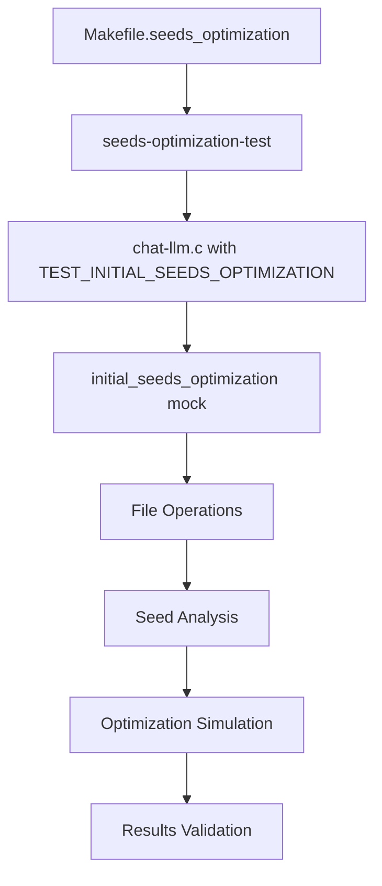

# Initial Seeds Optimization Testing

This directory contains test infrastructure for the **Initial Seeds Optimization** functionality of AFL-ICS, which uses `afl-cmin` to remove redundant seeds and improve fuzzing efficiency.

## 📋 Table of Contents

- [Overview](#overview)
- [Prerequisites](#prerequisites)
- [Quick Start](#quick-start)
- [Detailed Usage](#detailed-usage)
- [Test Results](#test-results)
- [Troubleshooting](#troubleshooting)
- [Implementation Details](#implementation-details)

   ## 🔍 Overview

The Initial Seeds Optimization feature uses `afl-cmin` to:

1. **Analyze code coverage**: Each seed is executed against the target program
2. **Identify redundant seeds**: Seeds that trigger identical code paths
3. **Keep minimal set**: Only retain seeds that provide unique coverage
4. **Improve efficiency**: Reduce fuzzing queue size by 50-90%

This testing framework validates that:
- Seed optimization logic works correctly
- File operations (backup, replace, cleanup) are safe
- Different seed count scenarios are handled properly
- Command line construction is correct

## 🛠️ Prerequisites

### System Requirements
- Linux/macOS with GCC compiler
- Standard UNIX utilities (cp, rm, mkdir)
- Shell with basic scripting support

### Required Libraries
Install the following development libraries:

```bash
# Ubuntu/Debian
sudo apt-get install libcurl4-openssl-dev libjson-c-dev libpcre2-dev

# macOS with Homebrew
brew install curl json-c pcre2
```

### For Real AFL-ICS Integration (Required for this test)
- afl-cmin utility in PATH (part of AFL installation)
- Valid target binary or command for afl-cmin to analyze

## 🚀 Quick Start

1. **Navigate to the test directory:**
   ```bash
   cd functional_test
   ```

2. **Run a basic test:**
   ```bash
   make -f Makefile.seeds_optimization test-basic
   ```
3. **Check the results:**
   ```bash
   ls -la test_seeds/
   ```

## 📖 Detailed Usage

### Building the Test Executable

```bash
# Check prerequisites first
make -f Makefile.seeds_optimization setup-env

# Build the test program
make -f Makefile.seeds_optimization all

# This creates: seeds-optimization-test
```

### Available Test Targets

| Target | Description | Seeds Created | Focus |
|--------|-------------|---------------|-------|
| `test-basic` | Basic functionality test | 10 generic | Core logic |
| `test-with-target` | Test with target command | 10 generic | Command construction |
| `test-modbus` | MODBUS protocol simulation | 15 MODBUS-like | Protocol-specific |
| `test-iec104` | IEC104 protocol simulation | 12 IEC104-like | Protocol-specific |
| `test-ethernetip` | EtherNet/IP protocol simulation | 18 EtherNet/IP-like | Protocol-specific |
| `test-slmp` | SLMP protocol simulation | 20 SLMP-like | Protocol-specific |
| `test-all` | Run all protocol tests | All above | Comprehensive |
| `test-performance` | Performance with many seeds | 50 seeds | Scalability |
| `test-ratios` | Different seed count scenarios | 0, 1, 5 seeds | Edge cases |
| `test-integration` | Diverse seed types | 5 diverse | Real-world simulation |

### Running Individual Tests

```bash
# Test specific protocols
make -f Makefile.seeds_optimization test-modbus
make -f Makefile.seeds_optimization test-iec104
make -f Makefile.seeds_optimization test-ethernetip
make -f Makefile.seeds_optimization test-slmp

# Performance and edge case testing
make -f Makefile.seeds_optimization test-performance
make -f Makefile.seeds_optimization test-ratios
make -f Makefile.seeds_optimization test-integration
```

### Running All Tests

```bash
make -f Makefile.seeds_optimization test-all
```

### Debug Mode

For detailed debugging information:

```bash
make -f Makefile.seeds_optimization debug-test
```

### Manual Execution

For custom testing scenarios:

```bash
# Build the executable
make -f Makefile.seeds_optimization all

# Run with custom parameters
./seeds-optimization-test <seed_dir> [target_binary] [mem_limit_mb] [timeout_ms] [qemu_mode]

# Examples:
./seeds-optimization-test ./my_seeds                                    # Basic test
./seeds-optimization-test ./my_seeds "./my_target @@" 100 2000 0       # With target
./seeds-optimization-test ./my_seeds "./my_target @@" 100 2000 1       # QEMU mode
```

## 📊 Test Results

### Output Structure

Each test creates and modifies directories:

```
<protocol>_seeds/           # Main seed directory
├── seed_001.bin           # Original/optimized seeds
├── seed_002.bin           
└── ...

<protocol>_seeds_backup/    # Backup of original seeds (if optimization ran)
├── seed_001.bin           # Original seeds before optimization
├── seed_002.bin           
└── ...

<protocol>_seeds_optimized/ # Temporary directory (cleaned up)
```

### Expected Output Format

```
Initial Seeds Optimization Test
===============================
Seed directory: test_seeds
Target command: echo 'Simulated target program'
Memory limit: 50 MB
Execution timeout: 1000 ms
QEMU mode: disabled

[*] Creating 10 test seeds in test_seeds...
  Created: test_seeds/seed_001.bin (9 bytes)
  Created: test_seeds/seed_002.bin (9 bytes)
  ...

Seeds before optimization: 10
Seed files:
  - seed_001.bin
  - seed_002.bin
  ...

Running initial_seeds_optimization()...
=====================================
[*] Optimizing initial seeds using afl-cmin...
[*] Running: afl-cmin -i 'test_seeds' -o 'test_seeds_optimized' -m 50 -t 1000 -- echo 'Simulated target program'
[*] Simulating afl-cmin execution (test mode)...
[*] Simulating optimization: 10 → 5 seeds
[*] Kept seed: seed_001.bin
[*] Kept seed: seed_003.bin
[*] Kept seed: seed_005.bin
[*] Kept seed: seed_007.bin
[*] Kept seed: seed_009.bin
[*] Backed up original seeds to test_seeds_backup
[+] Seed optimization completed: 10 → 5 seeds (50.0% reduction)

Results:
========
Seeds after optimization: 5
Remaining seed files:
  - seed_001.bin (9 bytes)
  - seed_003.bin (9 bytes)
  - seed_005.bin (9 bytes)
  - seed_007.bin (9 bytes)
  - seed_009.bin (9 bytes)

Optimization Summary:
====================
Original seeds: 10
Optimized seeds: 5
Reduction: 5 seeds (50.0%)

Test completed successfully!
```

### Protocol-Specific Seed Patterns

#### MODBUS Seeds
```
Hex: 00 01 00 00 00 06 FF 03 00 00 00 [ID]
- Transaction ID: 00 01
- Protocol ID: 00 00  
- Length: 00 06
- Unit ID: FF
- Function: 03 (Read Holding Registers)
- Start Address: 00 00
- Quantity: 00 [ID]
```

#### IEC104 Seeds
```
Hex: 68 04 07 00 00 00 [ID]
- Start: 68
- Length: 04
- Control Fields: 07 00 00 00
- Variable: [ID]
```

#### EtherNet/IP Seeds
```
Hex: 6F 00 04 00 [ID] 00 00 00
- Command: 6F 00
- Length: 04 00
- Session: [ID]
- Status/Context: 00 00 00
```

#### SLMP Seeds
```
Hex: 50 00 00 FF FF 03 00 [ID] 00 00 00 00
- Sub Header: 50 00
- Network/Station: 00 FF FF
- Module: 03 00
- Variable: [ID]
- Data: 00 00 00 00
```

## 🔧 Troubleshooting

### Common Issues

#### 1. Compilation Errors
```
fatal error: curl/curl.h: No such file or directory
```
**Solution**: Install required development libraries (see Prerequisites)

#### 2. No Seeds to Optimize
```
Info: Too few seeds (0) for optimization, skipping afl-cmin
```
**Solution**: 
- Ensure seed directory contains files
- Use test targets that create seeds automatically
- Check file permissions

#### 3. Command Construction Issues
```
Error: Unable to allocate memory for afl-cmin command prefix
```
**Solution**: 
- Check available memory
- Reduce parameter lengths
- Ensure valid input parameters

#### 4. File Operation Failures
```
Warning: Failed to backup original seeds
```
**Solution**:
- Check disk space
- Verify write permissions
- Ensure destination directories are accessible

#### 5. Simulated Optimization Issues
```
Warning: No seeds were optimized
```
**Solution**:
- Check seed file formats
- Verify file permissions
- Ensure proper directory structure

### Debug Information

For additional debugging:

1. **Check test setup:**
   ```bash
   make -f Makefile.seeds_optimization setup-env
   ```

2. **Run with debug flags:**
   ```bash
   make -f Makefile.seeds_optimization debug-test
   ```

3. **Manual verification:**
   ```bash
   ./seeds-optimization-test ./debug_seeds "echo test" 50 1000 0
   ```

4. **Check file operations:**
   ```bash
   ls -la test_seeds*
   ```

### Test-Specific Issues

#### Protocol Test Failures
- Verify protocol-specific seed generation in Makefile
- Check hex byte sequences for protocol compliance
- Ensure proper binary file creation

#### Performance Test Issues
- Monitor system resources during large seed tests
- Check filesystem limits for many small files
- Verify command-line length limits

## 🛠️ Implementation Details

### Test Architecture



### Key Functions Tested

- `initial_seeds_optimization()`: Main optimization logic
- `create_test_seeds()`: Generate protocol-specific test data
- File operations: backup, copy, replace, cleanup
- Command construction: afl-cmin parameter building
- Error handling: edge cases and failure scenarios

### Simulation vs Real Usage

| Aspect | Test Mode | Real AFL-ICS |
|--------|-----------|--------------|
| Target Execution | Simulated | Real binary execution |
| Coverage Analysis | File count based | Code coverage based |
| Optimization Logic | 50% reduction | Coverage-driven selection |
| afl-cmin Execution | Command display only | Actual execution |
| Error Handling | Same | Same |

### Test Validation

The test validates:

1. **Logic Flow**: Correct sequence of operations
2. **File Safety**: Backup before modification
3. **Error Handling**: Graceful failure scenarios  
4. **Parameter Passing**: Correct command construction
5. **Memory Management**: No memory leaks
6. **Edge Cases**: Empty dirs, single files, etc.

## 📝 Notes

- **Test Mode**: Uses simulation instead of real afl-cmin execution
- **Protocol Seeds**: Generated patterns mimic real protocol structures
- **File Operations**: Real file system operations for comprehensive testing
- **Performance**: Tests scalability with varying seed counts
- **Integration**: Validates end-to-end optimization workflow

## 🔄 Integration with AFL-ICS

For integration with real AFL-ICS:

1. Replace simulation with actual `afl-cmin` calls
2. Use real instrumented target binaries
3. Enable actual code coverage analysis
4. Integrate with AFL-ICS fuzzing workflow

Example real usage:
```bash
# In AFL-ICS context
afl-fuzz -i optimized_seeds -o output ./instrumented_target @@
```

## 📄 License

This test framework is part of AFL-ICS and follows the same license terms as the main project. 